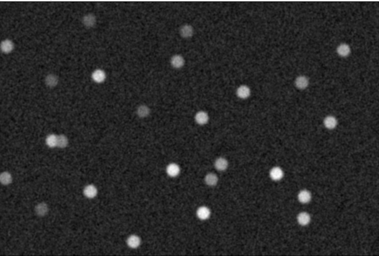
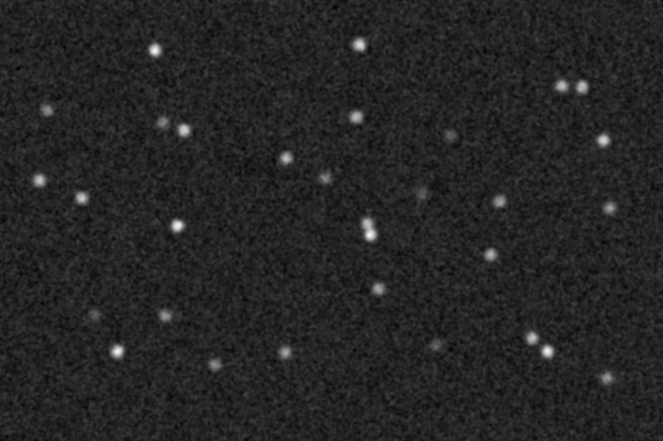

<hr>

<!--- ### **[Moodle BIO-410](https://moodle.epfl.ch/course/view.php?id=15721)**  

# Homework D - Tracking Spots

**Submission:** Send your documents as a single ZIP file on <span style="color:red">**EPFL Moodle**</span> by the due date.

> **Hint:** The code should be written as ImageJ plugin based on the provided Java template.


## Description
In this homework, we propose several implementations of basic algorithms to track 
bright spots (cell) across frames of an images sequence. The output is a list of spot trajectories. 

The division of spot (cell) is not handled. Instead, we apply a simple rule: one of the daughter cell is following the same trajectory of the mother cell, the other daughter cell is
starting a new trajectory.

Only two files has to be modified `Tracking_Bright_Spots.java` and `DistanceAndIntensityCost.java`. 
The other files should not be modified for this homework, as they are building the underlying architecture of the code.

To help you, some ``TODO`` have been added in the two codes.

### Information on the graph structure
To store the graph we provide simple Java classes.

#### Spot.java 
This allows to store a detected bright spot: the coordinate (x,y) the frame number (t) and the pixel value.
```
public class Spot {
    public int x;
    public int y;
    public int t;
    public double value = 0;
}
```

#### Spots.java
This is a list of Spot which inherits of the Java class ArrayList. 
Useful methods are ``add(spot)``, ``spot = get(index)``, or ``size()``. This is 
one partition which is associated with a random color.
```
public class Spots extends ArrayList<Spot> {
    public Color color;
}
```

#### PartitionedGraph.java
This is a list of Spots. In the tracking problem, we will use to store 2 partitioned graphs:
1) `frames` is a list `frame` where `frame` is a partition containing a list of all spots of given frame
2) `trajectories` is a list `trajectory` where `trajectories` trajectories containing a list of all spots belong to the same trajectory
The class contains methods to draw spots `drawSpots` and to draw segment lines `drawLine` between spot of the same partition (trajectory.)
```
public class PartitionedGraph extends ArrayList<Spots> {
}
```

### Information on the cost function
A good practice is to write each cost function is separate class. 
Here, we propose `AbstractCost.java` as an interface (i.e. template class) for different cost functions.
We also provide one implemenation of a basic cost function `SimpleDistanceCost.java` that implements the
methods ``evaluate()`` and ``validate()``, coming from `AbstractCost.java`.


## Data
- We provide two time-sequences ``easy.tif`` and to ``homework.tif`` of moving spots.
  You can find the two sequences related to this homework on the OMERO database ; under the ``Homework D`` project.<br>
  Link to images : [https://omero.epfl.ch/webclient/?show=project-2846](https://omero.epfl.ch/webclient/?show=project-2846)

<div align="center" >
  
  
  <br>
    Left : <code>easy.tif</code> ; right : <code>homework.tif</code>
</div>

- Template code, as described above, is provided as a basis to make the tracking work.

## Task
### Question 1 - Understand the spot detector
The code of the bright spots detector is already provided in three Java methods : `detect()`, `dog()`, `localMax()`
- Write down the method description (i.e. java doc) of each of these 3 methods,
to explain what is the goal of the method and what are the input ou output parameters.


### Question 2 - Test the code
One algorithm `trackToFirstValidTrajectory()` is already implemented using the provided 
cost function `SimpleDistanceCost()`. 
- Run the code on the image sequence `easy.tif`. 
- Tune and select the appropriate parameters (sigma, threshold and distmax) to get right the spot trajectories.
- Save the screenshot with the trajectories.

### Question 3 - Multiple criteria cost function
In this question, you'll implement the `DistanceAndIntensityCost` cost function.
- In the class `DistanceAndIntensityCost`, write down the cost function implementation under the method `evaluate()`.
The cost function is composed of the weighted sum of the normalized distance term and the
normalized intensity term :
> cost_function  = lambda * dist(xa, xb) / normDist + (1 - lambda) * abs(I(xa) - I(xb)) / normInt
>
> - `lambda` is the hyperparameter to balance the 2 terms.
> - `normDist` is the normalization distance value
> - `normInt` is the normalization intensity value
> - ``xa`` and ``xb`` are the spots to evaluate.

### Question 4 - Improve the tracking algorithm
With the algorithm `trackToFirstValidTrajectory()`, which takes the first valid spot, 
based on the distance, as next trajectory spot, the results is
sensitive to the ``distmax`` parameter. 
- Fill the method `trackToNearestValidTrajectory()` with your code to connect the
trajectory to the nearest spot of the next frame. By 'Nearest', it is meant 'the spot
that has the minimum cost value'. The cost value should be computed using the previous cost function.

### Question 5 - Test your own tool
- Run the tracking algorithm `trackToNearestValidTrajectory()` that you've just implemented on the image sequence `homework.tif`.
- Select the appropriate parameters(sigma, threshold lambda and costmax) to get the right spot trajectories.
- Save the screenshot with the trajectories.

### Question 6 - GUI implementation
In this question, we ask you to integrate a GUI at the beginning of the plugin to select parameters.
You are free to add as many parameters / inputs as you wish in the GUI, as long as the following mandatory
ones are provided
- Image selection for the processing
- The 5 parameters listed at the beginning of the `Tracking_Bright_Spots` class

There is no restrictions on the library to create the GUI. 
You can use either the ``GenericDialog`` object provided with the ImageJ-Java library, or `Scijava` parameters.

### BONUS Question - Merge trajectories when spots divide
As a post-processing, we propose to virtually 'merge' the trajectory of the mother cell
with the trajectories of the two daughter cells by assigning the same color
to the mother and to the daughter cells. A simple criteria of proximity (less than 
the variable `proximityDivision` which encodes a distance) is applied to 'merge' the trajectories together.

- Write down the code under the method `colorDivision()` to assign the same 
color to the mother/daughter cells trajectories
- Run the code on `homework.tif` image sequence.
- Save a screenshot of the with the merged trajectories.

## Submission
The submission must include the following files, compressed into a single ZIP file :
- Your source code (intelliJ project)
- A screenshot of the colored trajectories on `easy.tif` obtained in Question 2
- A screenshot of the colored trajectories on `homework.tif` obtained in Question 5
- A text file, filled with the value of the parameters for the Question 2 and Question 5
- For the BONUS question only, a screenshot of the colored trajectories on `homework.tif`

The final zip has to be uploaded on Moodle platform.

## Learning objectives
At the end of this homework, you should be able to:
- Write Javadoc by explaining what a method is performing and what the input parameters and the return value represent.
- Build a simple tracking algorithm, based on a cost function.
- Build the cost function for a tracking algorithm and understand how its parameters influence the result.
- Adapt image pre-processing to the image content.
- Create a minimal GUI to enter different set of parameters.